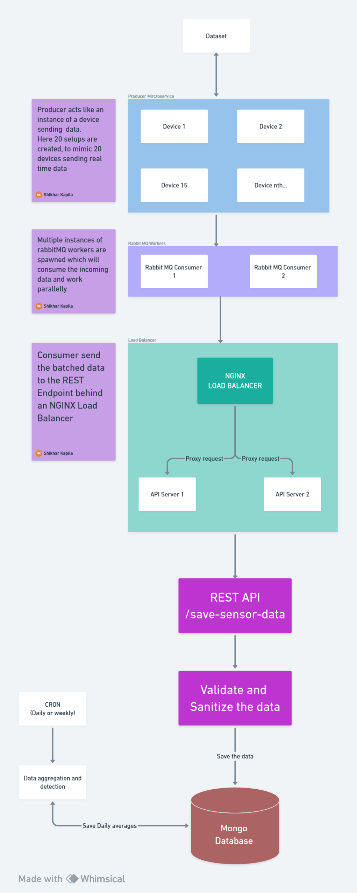
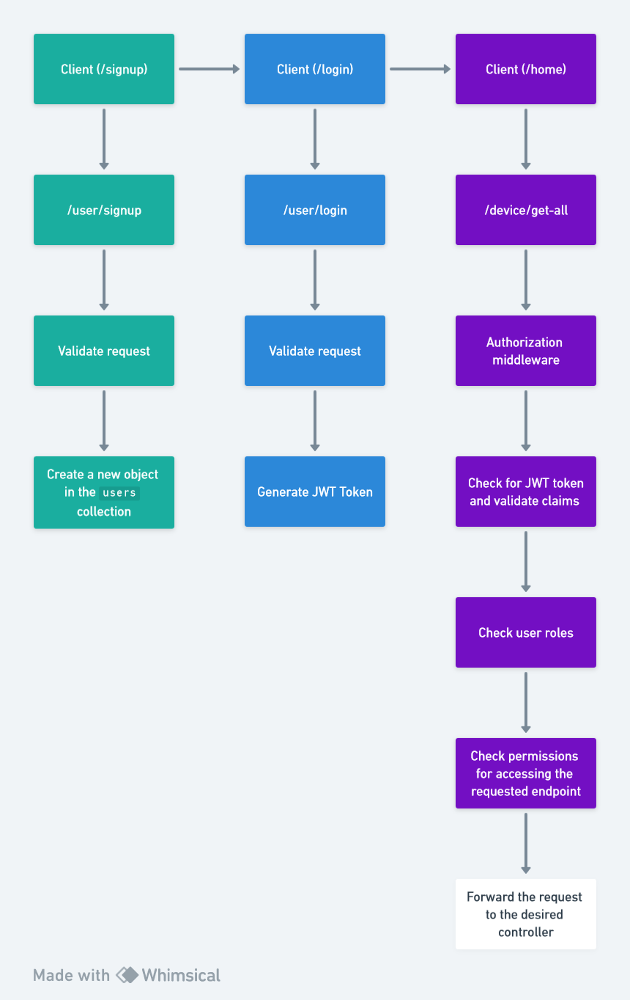

# praan-fullstack-task
Mircoservice architecture with frontend for designing the praan platform.

# Sytem Architecture


## Overview
This projects is build using docker-compose for simplicity where multiple microservices and API servers work together to process large quantities of incomign data. It consists of following:

### Components:

1. Producers: Producer mimics an MKII device which is sending relatime data over the network. For demo puposes 20 such producers are created using go routines which send batched data to the RabbitMQ Consumers.

2. RabbitMQ Message Workers (2 Consumers): RabbitMQ is used as the message broker to decouple producers from consumers.Two consumer instances pull data from RabbitMQ queues and initiate processing. 

3. Nginx Load Balancer:Nginx serves as a load balancer to distribute incoming API requests  from the consumers across the two API server instances.

4. API Servers:These instances are responsible for processing incoming requests from RabbitMQ.They handle data validation & sanitization. Apart from saving the incoming data, authroization and daily averages API are running on this


5. MongoDB Database:MongoDB is used for storing the processed data as well as data coming from the cron job 

6. Redis: Redis is setup to fetch historical data consumed from the `/device/get-all` API.

7. Cron: A cron is setup which runs every 2 minutes which calculates the daily average values from the `devices` collection and stores in the `dailyaverages` collection

## System Flow

1. Producers generate batches of data and send it to specific queues in RabbitMQ.

2. RabbitMQ workers listen on the queue and pick up the batched data and makean  API requests and send them to the Nginx load balancer.

3. Nginx, the load balancer, distributes incoming API requests to the two API server instances for load balancing and redundancy.

4. API server instances perform the following tasks:


    4.1 Data validation: Ensure that the data meets required criteria.

    4.2 Sanitization: Cleanse data to prevent malicious input or errors.

    4.3 Process the data as needed for the specific application logic.

5. After processing, API servers store the results in the MongoDB database.


# Algorithms
## Daily averages
For calculating daily averages, a cronjob is setup which will periodically run every 2 minutes (configurable) and aggregate the sensors data into daily averages for the `p1`, `p25` & `p10` values and stored in the `dailyaverages` collection

```*/2 * * * * node /app/dist/index.js 2>&1' >> /etc/crontabs/root ```


# Optimization
## Redis
For faster fetching the historical data based on the date-range redis is used which stores the queried data where  key is the hashed subtraction of the requested date range end_date - start_date.

This speeds up the data retrival for same date-range requests


# Authorization and User management



## Roles
1. `user`: Default role for user created via the system
2. `admin`: Role created for managing users

## Permissions
1. `read.devices` : Permission for all users to GET request the sensors data
2. `remove.users` : Permission only for admins to remove a user

## Admin
During the initial setup of the `/api` , custom code is added for initiation the `admin` user. This is only for the task and not for any other reason.


# API Endpoints
The following Endpoints are deployed 
1. `/device/get-all` : Get all the sensors data filtered by date-range
2. `/device/:id` : Get a specific sensor data  filtered by date-range
3. `/save-sensor-data`: Save the incoming sensors data
4. `/user/signup` : Register a new user
5. `/user/login`: Login a user
6. `/daily-average`: Get  all the sensors data filtered by date-range
7. `/admin/remove`: for admins to remove a particular user.

### `/admin/remove`

Admin credentials:

Email: `random`

Passowrd : `admin123`

To verify the admin access, send a POSTMAN request to 
`http://localhost:80/admin/remove` with the Authorization Token and following request body after the docker-compose is running

```
    {
        email: ["somerandom@email.com"]
    }
```

# MongoDB Schema

1. users: Store the users with fields
``` 
  name: {
        type: String,
        required: true
    },
    password: {
        type: String,
        required: true
    },
    created_at: Date,
    email: {
        type: String,
        required: true
    },
    roles: {
        type: [String],
        required: true,
    },
    permissions:{
        type: [String],
        required: true
    }
```

2. devices: 
```
 device: {
        type: String,
        required: true
    },
    windDirection: {
        type: String,
        required: true
    },
    windSpeed: {
        type: Number,
        required: true
    },
    timestamp: {
        type: Number,
        required: true,
        index: true
    },
    p1: {
        type: Number,
        required: true
    },
    p25: {
        type: Number,
        required: true
    },
    p10: {
        type: Number,
        required: true
    }
```

3. dailyaverages:
```
    date: {
        type: String,
        required: true,
    },
    p1: {
        type: Number,
        required: true
    },
    p25: {
        type: Number,
        required: true
    },
    p10: {
        type: Number,
        required: true
    }
```

# How to run

## Frontend
`cd` into the frontend directory and run:
1. `npm install`
2. `npm start`

## Backend

### Docker

This is the ideal approach to run the system without manually running `npm-start` in each folder

**Important** : Rabbit MQ might take some time to start up, a general wait time after running `docker-compose up` is around 1 minute.


**RUN**

`docker-compose build`

`docker-compose up`

### Locally
Perform the steps in order:

1. `cd api && npm start`
2. `cd consumer && npm start`
3. `cd producer && ./producer`